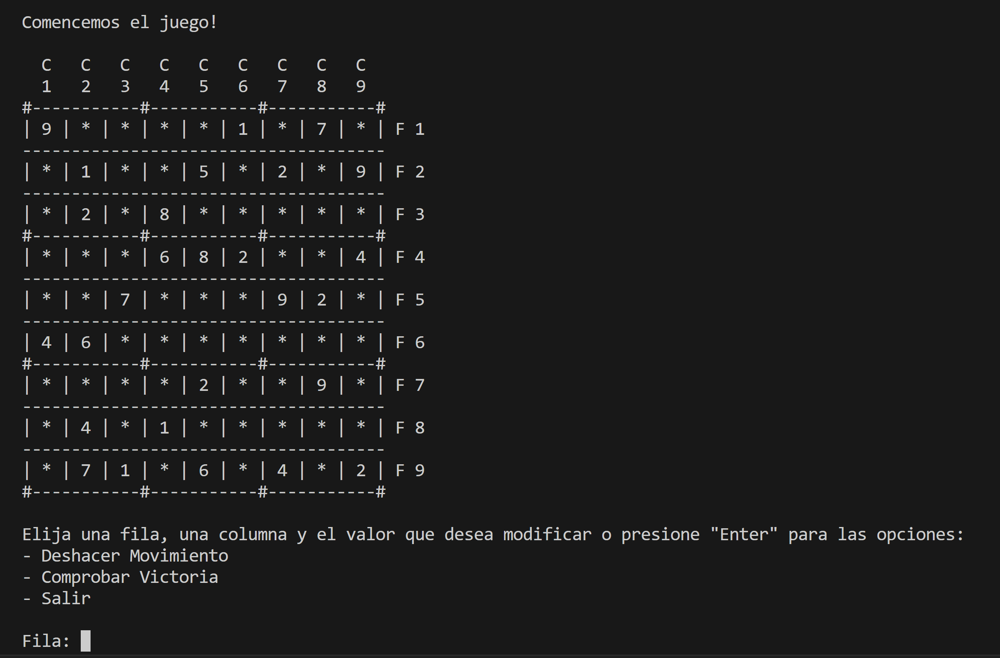
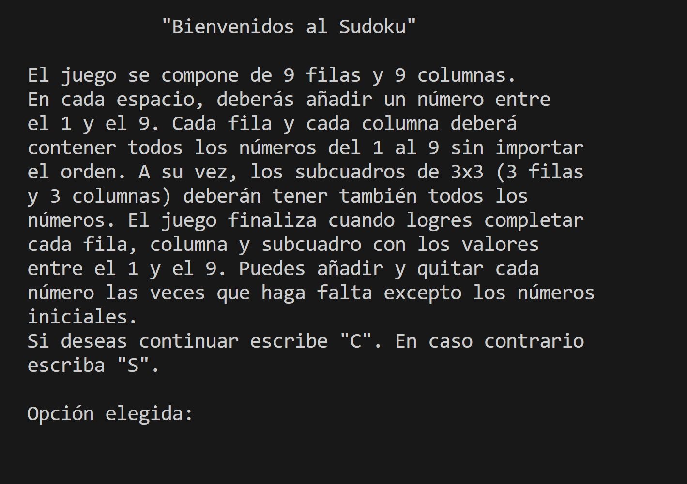
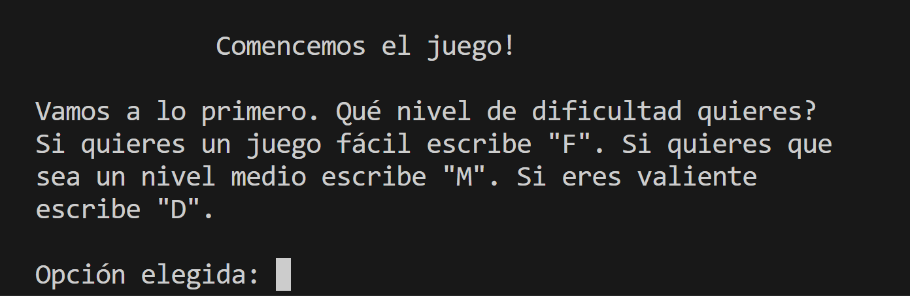
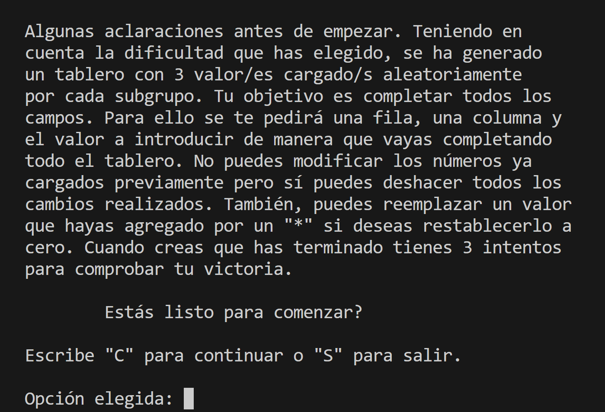
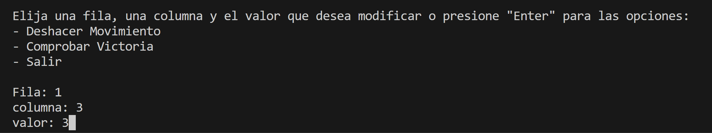
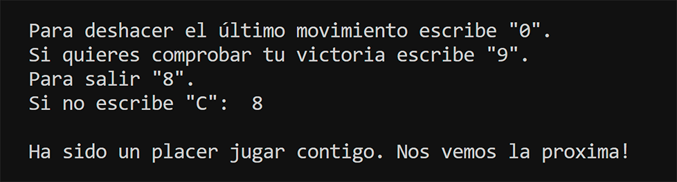

# Juego Sudoku

##### Es un juego realizado con Python que emula por terminal al clásico juego. 

##### >> Inicialmente el juego nos da la bienvenida y ofrece una breve explicación de sus reglas:

##### >> Seguido de esto nos pide elegir el nivel de dificultad: 

##### >> A continuación, se explica al jugador las condiciones puntuales del juego:

 

##### >> Luego, se pide que se elija una fila, columna y valor para modificar el tablero:

##### >> En caso de que se haya elegido pulsar "Enter" se despliega el menú que permite deshacer el último movimiento, comprobar la victoria, salir o continuar:

##  Hola, soy Esteban Santos Mendoza!!  

##### Soy informático que trabaja hace 5 años en el mundo del soporte técnico. Actualmente me estoy formando como desarrollador en Python.
##### En mi perfil de GitHub tienes más información sobre mi. Saludos!

